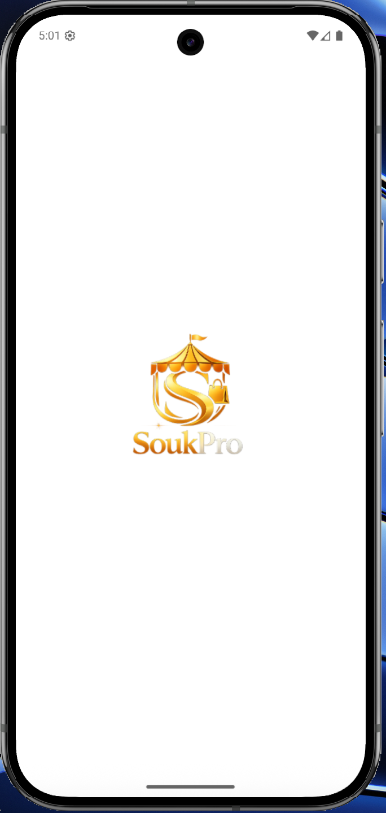
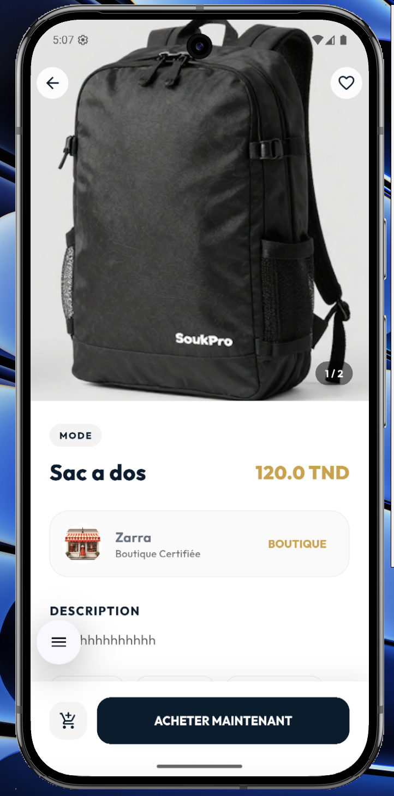
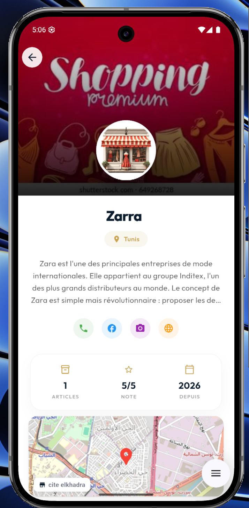
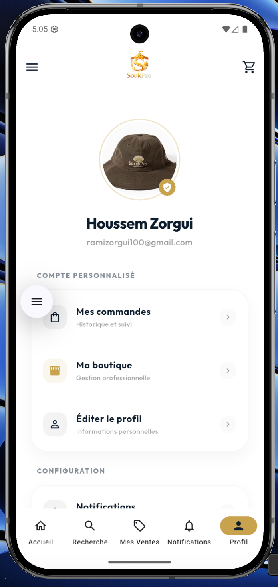
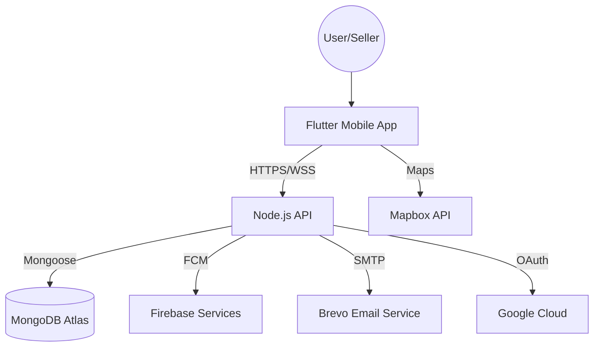

<div align="center">
  
  <h1>🛍️ SoukPro</h1>
  <p><b>The Ultimate Modern E-Commerce Platform & Multi-Vendor Marketplace</b></p>

  [](https://flutter.dev)
  [](https://nodejs.org)
  [](https://www.mongodb.com)
  [](https://expressjs.com)
  [](https://firebase.google.com)

  <p><i>A premium full-stack solution featuring a high-performance Flutter mobile app and a robust Node.js REST API.</i></p>

  [Key Features](#-key-features) • [Visual Showcase](#-visual-showcase) • [Architecture](#-architecture) • [Setup Guide](#-setup-guide) • [API Reference](#-api-endpoints)
</div>

---

## 📱 Visual Showcase

Experience the sleek and modern user interface of SoukPro. Our design prioritizes user engagement and a seamless shopping experience.

<div align="center">
  <table style="border: none;">
    <tr>
      <td align="center">
        <br>
        <sub><b>Splash Screen</b></sub>
      </td>
      <td align="center">
        <br>
        <sub><b>Login</b></sub>
      </td>
      <td align="center">
        <br>
        <sub><b>Registration</b></sub>
      </td>
    </tr>
    <tr>
      <td align="center">
        <br>
        <sub><b>Product Discovery</b></sub>
      </td>
      <td align="center">
        <br>
        <sub><b>Marketplace</b></sub>
      </td>
      <td align="center">
        <br>
        <sub><b>User Profile</b></sub>
      </td>
    </tr>
  </table>
</div>

---

## 🎯 Overview

**SoukPro** is more than just a shopping app; it's a complete ecosystem for modern commerce. Whether you're a casual buyer or a professional seller, SoukPro provides the tools you need to succeed.

- 🏗️ **Multi-Vendor Ecosystem**: Seamlessly transition between buying and selling.
- ⚡ **Real-Time Auctions**: High-stakes bidding powered by WebSockets (Socket.IO).
- 🔐 **Enterprise-Grade Security**: JWT authentication, KYC verification, and secure storage.
- 💳 **Flexible Financials**: Support for direct payments, installment plans, and COD.
- 🚀 **Next-Gen Mobile Exp**: A fluid, responsive Flutter app designed for performance.

---

## ✨ Key Features

### 👤 User Excellence
- **Omni-Channel Auth**: Email/Password, Google OAuth 2.0, and secure verification via Brevo.
- **Dynamic Roles**: Dedicated workflows for `Users`, `Professional Sellers`, and `Admins`.
- **KYC Compliance**: Integrated verification system for professional trust.
- **Address Management**: Multi-address support for seamless shipping.

### 📦 Product & Marketplace
- **Versatile Sales**: Fixed-price listings and real-time competitive auctions.
- **Rich Catalog**: Multi-image support, smart categorization, and stock tracking.
- **Premium Exposure**: Featured product highlights and advanced search filtering.
- **Condition Grading**: Clear status from "New" to "Used - Fair".

### 🔨 Auction Dynamics
- **Live Bidding**: Instant updates without page refreshes using Socket.IO.
- **Smart Notifications**: Instant alerts when outbid via Firebase Cloud Messaging.
- **Auto-Closing**: Scheduled auction endings with winner determination.

### 🛒 Commerce & Logistics
- **Smart Checkout**: Multi-vendor cart management with unified payment processing.
- **Order Tracking**: Comprehensive status updates (Pending → Confirmed → Shipped → Delivered).
- **Payment Gateway**: Integrated with Click to Pay, Flouci, and Cash on Delivery.

### 🏪 Professional Tools
- **Shop Analytics**: Real-time insights into sales, product performance, and ratings.
- **Brand Identity**: Customizable shop profiles with logos, banners, and location mapping (Mapbox).

---

## 🏗️ Architecture

### High-Level System Design



### Modular Repository Structure

| Module | Responsibility | Pattern |
| :--- | :--- | :--- |
| **Backend** | REST API, WebSockets, DB Auth | MVC (Model-View-Controller) |
| **Mobile** | UI/UX, State Management, Local Storage | Feature-First / Provider |

---

## 🚀 Tech Stack

### 📱 Frontend (Mobile)
| Component | Technology | Detail |
| :--- | :--- | :--- |
| **Framework** | Flutter 3.7.2 | Cross-platform Excellence |
| **State** | Provider 6.1.5 | Robust Reactive State |
| **Network** | Dio 5.9.1 | Advanced HTTP client |
| **Real-time** | Socket.IO Client | Low-latency WebSockets |
| **Storage** | Secure Storage | Encrypted token management |
| **Analytics** | FL Chart | Interactive data visualization |

### 🔧 Backend (Infrastructure)
| Component | Technology | Detail |
| :--- | :--- | :--- |
| **Runtime** | Node.js 18.x | High-concurrency JavaScript |
| **Framework**| Express 5.2.1 | Fast, unopinionated web framework |
| **Database** | MongoDB Atlas | Cloud-native NoSQL |
| **Auth** | JWT & Bcrypt | Industry-standard security |
| **Communication** | Socket.IO | Bi-directional real-time engine |
| **Emails** | Brevo Service | Transactional email reliability |

---

## ⚙️ Setup Guide

### Prerequisites
- Node.js 18.x+ & npm/yarn
- Flutter SDK 3.7.2+
- MongoDB Atlas Account
- Firebase Project (configured for Android/iOS)

### 1. Backend Initialization
```bash
cd backend
npm install
cp .env.example .env # Configure your variables
# Add your firebase-service-account.json
npm run dev
```

### 2. Mobile Initialization
```bash
cd mobile
flutter pub get
# Configure API URL in lib/core/constants/api_constants.dart
flutter run
```

---

## 🔒 Security First
- ✅ **Bcrypt Hashing**: 10-round salt for all passwords.
- ✅ **RBAC**: Strict Role-Based Access Control on all endpoints.
- ✅ **Secure Storage**: Sensitive data never stored in plain text on device.
- ✅ **Data Sanitization**: Internal protection against NoSQL injection.

---

## 👨‍💻 Development Team
**Houssem Zorgui**
- 📧 [houssemzorgui10@gmail.com](mailto:houssemzorgui10@gmail.com)
- 🐙 [GitHub Profile](https://github.com/HoussemZorgui)

---

<div align="center">
  <p><b>If you find this project useful, please give it a ⭐ on GitHub!</b></p>
  <sub>Built with passion for the global marketplace.</sub>
</div>
